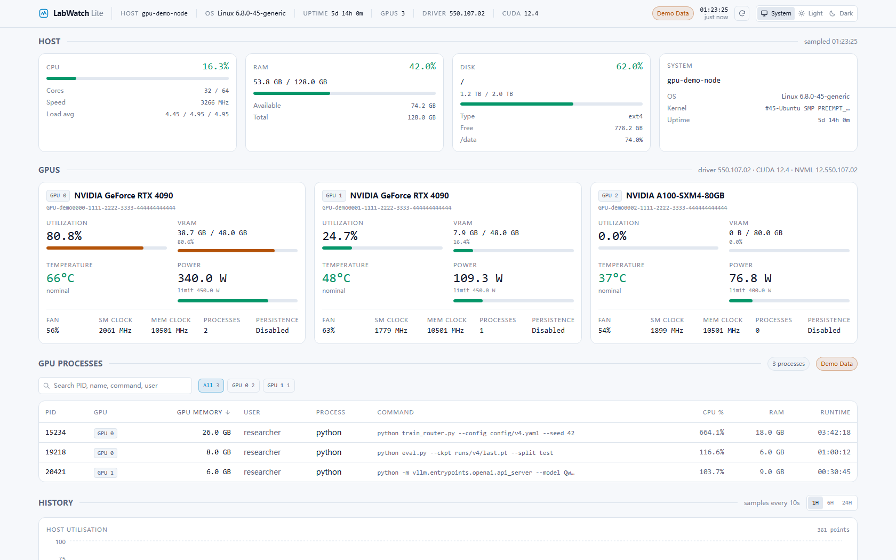
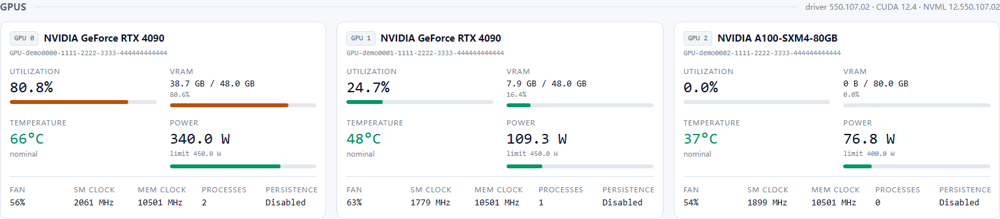
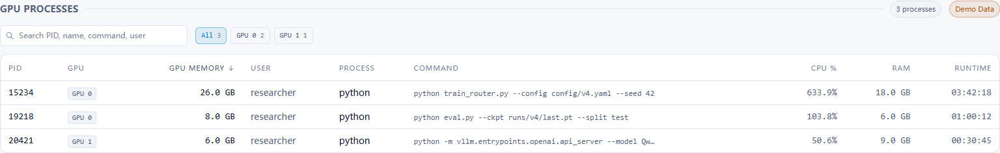
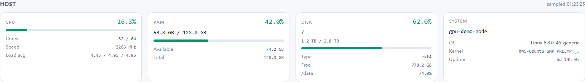
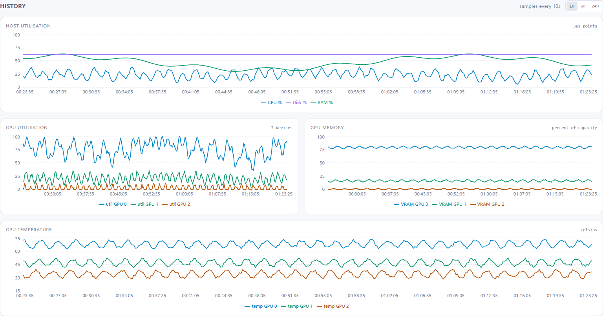
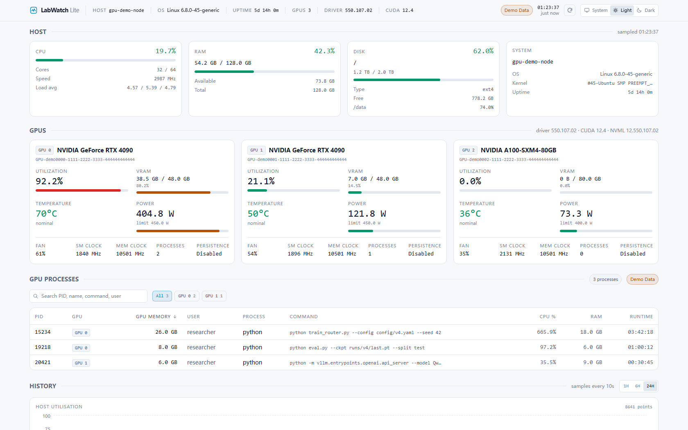
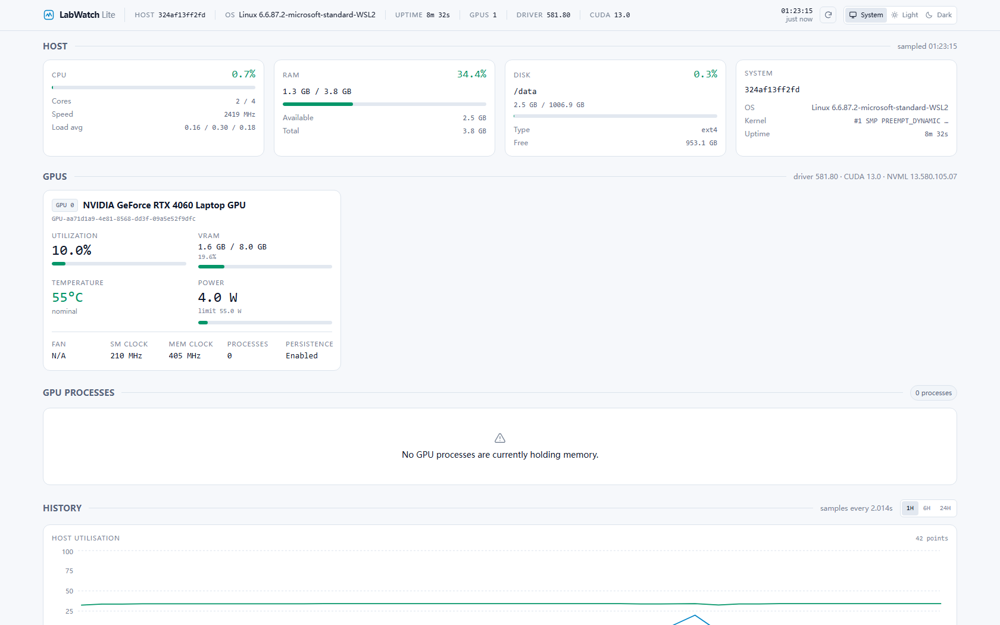
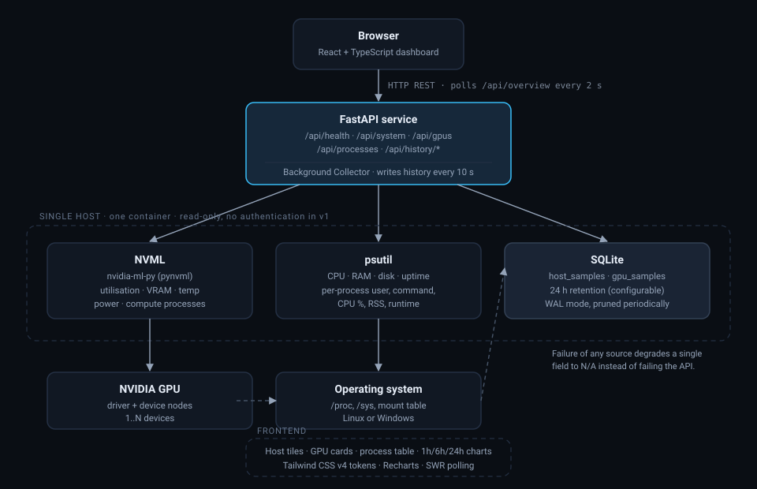

<div align="center">

# LabWatch Lite

**A lightweight self-hosted dashboard for monitoring NVIDIA GPUs and AI development servers.**

Stop SSHing in to run `nvidia-smi`, `htop` and `df -h`. Open a browser instead.

[](../../actions/workflows/ci.yml)




</div>

---

## Why

Training a model, running inference, or sweeping evaluations means asking the same
questions over and over:

- Which GPU is free right now?
- Is the GPU actually computing, or just holding memory?
- Who is using GPU 1, and how long have they been running?
- Is RAM about to be exhausted? Is the disk nearly full?
- What did utilisation look like over the last hour?

LabWatch answers all of them on one page that refreshes itself every two seconds.

## Features

| | |
|---|---|
| **GPU telemetry** | Utilisation, VRAM, temperature, power (with its limit), fan, SM/memory clocks, persistence mode and process count for every NVIDIA device. |
| **GPU process mapping** | NVML compute PIDs joined to OS process data: user, full command line, CPU %, resident memory, start time and runtime. |
| **Host telemetry** | CPU (usage, cores, frequency, load average), RAM, disk (primary mount plus optional extra mounts), hostname, OS, kernel and uptime. |
| **History** | CPU, RAM, disk, GPU utilisation, VRAM, temperature and power persisted to SQLite, charted over **1H / 6H / 24H**. |
| **Process table** | Sort by any numeric column, filter by GPU, and search across PID, process name, command and user. |
| **Graceful degradation** | No driver, no GPU, an unsupported sensor or a process that exits mid-query shows `N/A` — never a broken page or a crashing API. |
| **Demo mode** | `LABWATCH_DEMO_MODE=true` serves realistic synthetic GPUs, processes and history, clearly labelled **Demo Data**, so the UI works without an NVIDIA card. |
| **Themes** | System / Light / Dark, applied before first paint so there is no flash. |
| **Read-only** | LabWatch never modifies the host it monitors. No agents to install, no shell, no scheduler. |

<table>
<tr>
<td width="50%"><br><sub><b>One card per GPU</b> — the visual centre of the page</sub></td>
<td width="50%"><br><sub><b>GPU processes</b> — sortable, filterable, searchable</sub></td>
</tr>
<tr>
<td width="50%"><br><sub><b>Host overview</b> — CPU, RAM, disk, system</sub></td>
<td width="50%"><br><sub><b>History</b> — 1H / 6H / 24H</sub></td>
</tr>
<tr>
<td colspan="2"><br><sub><b>Light theme</b> — same information density, different surface</sub></td>
</tr>
<tr>
<td colspan="2"><br><sub><b>Real hardware, no demo data</b> — an RTX 4060 through NVML, and the empty state when nothing holds GPU memory</sub></td>
</tr>
</table>

## Quick Start

### Docker Compose (recommended)

```bash
git clone https://github.com/OWNER/labwatch.git
cd labwatch
docker compose up -d
```

Open <http://localhost:8000>. History is stored in the `labwatch-data` volume and
survives restarts.

GPU access requires the [NVIDIA Container Toolkit](https://docs.nvidia.com/datacenter/cloud-native/container-toolkit/latest/install-guide.html)
on the host. Without a GPU the container still runs — CPU, RAM and disk are
monitored as usual.

**No GPU? Try the demo:**

```bash
docker compose -f docker-compose.yml -f docker-compose.override.yml up --build
```

### Run from source

Backend:

```bash
cd backend
python -m venv .venv && . .venv/bin/activate   # Windows: .venv\Scripts\activate
pip install -r requirements.txt
uvicorn app.main:app --host 0.0.0.0 --port 8000
```

Frontend (second terminal):

```bash
cd frontend
npm install
npm run dev        # http://localhost:5173, proxies /api to :8000
```

For a single-origin deployment, build the UI and let FastAPI serve it:

```bash
cd frontend && npm run build && cp -r dist ../backend/static
# backend now serves the dashboard at http://localhost:8000
```

## Architecture



One host, one container, three data sources:

- **NVML** (`nvidia-ml-py`) for GPU telemetry and compute process IDs.
- **psutil** for host metrics and for enriching GPU PIDs with user, command, CPU and runtime.
- **SQLite** for the history series, in WAL mode, pruned to a configurable retention window.

The dashboard polls `/api/overview` on an interval the backend advertises, which
collapses a refresh into a single round trip. Polling pauses while the tab is
hidden. v1 deliberately avoids WebSockets: at a 2 second refresh they add
complexity without changing the experience.

```
labwatch/
├── backend/
│   ├── app/
│   │   ├── api/            # route modules: health, system, gpu, history, overview
│   │   ├── collectors/     # psutil host collector, NVML GPU collector, demo source
│   │   ├── services/       # monitoring facade, history persistence, background loop
│   │   ├── config.py       # LABWATCH_* settings
│   │   ├── database.py     # SQLAlchemy models: host_samples, gpu_samples
│   │   ├── schemas.py      # Pydantic response models
│   │   └── main.py         # app factory, lifespan, static frontend mount
│   ├── tests/              # 96 pytest tests
│   └── Dockerfile
├── frontend/
│   ├── src/
│   │   ├── components/     # header, host tiles, GPU cards, process table, charts
│   │   ├── hooks/          # SWR polling, theme
│   │   ├── lib/            # formatting and status-level helpers
│   │   ├── services/       # typed API client
│   │   └── types/          # mirrors backend/app/schemas.py
│   ├── e2e/                # Playwright suite
│   └── scripts/            # dev server, screenshot automation
├── docs/images/            # screenshots used above
├── docker-compose.yml
└── .github/workflows/ci.yml
```

## Configuration

Everything is an environment variable with the `LABWATCH_` prefix. See
[`.env.example`](.env.example) for the annotated list.

| Variable | Default | Purpose |
|---|---|---|
| `LABWATCH_POLL_INTERVAL` | `2` | Seconds between live metrics refreshes advertised to the UI. |
| `LABWATCH_HISTORY_INTERVAL` | `10` | Seconds between persisted history rows. |
| `LABWATCH_RETENTION_HOURS` | `24` | How long history is kept. |
| `LABWATCH_RETENTION_MAX_ROWS` | `200000` | Safety cap per table; oldest rows are pruned first. |
| `LABWATCH_DATA_DIR` | `backend/data` | Directory holding `labwatch.db`. |
| `LABWATCH_DATABASE_URL` | *(derived)* | Full SQLAlchemy URL; overrides `DATA_DIR`. |
| `LABWATCH_DEMO_MODE` | `false` | Serve synthetic data labelled **Demo Data**. |
| `LABWATCH_ENABLE_BACKGROUND_COLLECTOR` | `true` | Persist history in the background. |
| `LABWATCH_COLLECT_COMMANDS` | `true` | Read full process command lines (`/proc` access permitting). |
| `LABWATCH_INCLUDE_GRAPHICS_PROCESSES` | `false` | Also list graphics contexts. On Windows desktops this adds every compositing GUI process. |
| `LABWATCH_PROCESS_LIMIT` | `64` | Maximum GPU processes enriched per sample. |
| `LABWATCH_CORS_ORIGINS` | `*` | Comma-separated allowed origins. |
| `LABWATCH_LOG_LEVEL` | `INFO` | Standard Python log level. |

### Reporting GPU processes the way you expect

NVML exposes compute (`C`) and graphics (`G`) contexts. LabWatch lists **compute
processes by default**, matching `nvidia-smi --query-compute-apps`. On Windows
every WDDM application appears in that list, so the table can be long; that is
the driver's view of the device, not a bug. Set
`LABWATCH_INCLUDE_GRAPHICS_PROCESSES=true` to include graphics contexts as well.

## API

Interactive documentation is served at `/api/docs`.

| Endpoint | Returns |
|---|---|
| `GET /api/health` | Service status, database state, NVML availability and collector state. |
| `GET /api/overview` | System + GPUs + processes in one payload (what the UI polls). |
| `GET /api/system` | Host CPU, memory, disk and uptime. `?all_mounts=true` adds every mount. |
| `GET /api/gpus` | Live state of every GPU, including `available`/`error` when NVML is unusable. |
| `GET /api/processes` | GPU processes. `?gpu_index=1` filters to one device. |
| `GET /api/history/system?range=1h` | Host history. `range` is `1h`, `6h` or `24h`. |
| `GET /api/history/gpus?range=1h` | GPU history for all devices. |
| `GET /api/history/gpus/{index}?range=1h` | GPU history for one device. |

```bash
curl -s localhost:8000/api/overview | jq '.gpus.gpus[] | {index, utilization_percent, temperature_c}'
```

Fields a host cannot report are `null`, which the dashboard renders as `N/A`.
`/api/gpus` and `/api/processes` still return HTTP 200 with `available: false`
and an `error` string when the driver is missing, so a health check can tell
"reachable but degraded" apart from "unreachable".

## Testing

```bash
# Backend: 112 tests, collector failure modes included
cd backend && pip install -r requirements-dev.txt && pytest

# Frontend: 75 tests
cd frontend && npm install && npm run test

# Browser end-to-end: 8 tests, starts its own demo backend and dev server
cd frontend && npx playwright install chromium && npm run e2e
```

The backend suite replaces NVML with a fake, so it covers a missing driver, a
host with no GPU, unsupported power/fan/clock sensors, processes that exit
between the NVML query and the psutil lookup, and NVML calls that raise. CI runs
lint, backend tests with coverage, frontend tests, the production build, the
Playwright suite and a Docker build with a container smoke test.

## Tech Stack

**Backend** Python 3.10+ · FastAPI · pydantic-settings · psutil · nvidia-ml-py · SQLAlchemy 2 · SQLite · pytest
**Frontend** React 19 · TypeScript (strict) · Vite · Tailwind CSS v4 · Recharts · SWR · Vitest · Testing Library
**Deployment** Docker (multi-stage) · Docker Compose · GitHub Actions

## Limitations

- **Single host.** LabWatch monitors the machine it runs on. Multi-server
  aggregation is out of scope for v1.
- **No authentication.** Intended for trusted private networks. Process command
  lines can contain sensitive arguments, so do not expose it to the public
  internet without a reverse proxy that adds authentication.
- **NVIDIA only.** AMD and Intel GPUs are not read.
- **Graphics contexts on Windows** are noisy by default; see above.
- **History is sampled, not streamed.** A 10 second write interval means brief
  spikes between samples are not captured.
- **Load average is `N/A` on Windows**, because the platform does not expose it.
- **Disk reports the most meaningful mounted filesystem.** The primary disk is
  the root filesystem when it is a real device. In a container whose root is an
  `overlay` filesystem (Docker Desktop, for example) it falls back to the
  shallowest real mount, and container disk figures describe the container's
  filesystem rather than the host's. Run LabWatch directly on the host if you
  need host disk numbers.

## Roadmap

Beyond v1, driven by actual use rather than speculation:

- Optional token authentication for exposed deployments
- Prometheus `/metrics` export
- Alert thresholds (VRAM, temperature, disk) with webhook delivery
- Multi-host aggregation behind a single dashboard
- WebSocket push for sub-second refresh

## Documentation

- [`docs/PROJECT_REPORT.html`](docs/PROJECT_REPORT.html) — consolidated build report: features, architecture, test results, bugs found and fixed, and release readiness.
- [`docs/ACCEPTANCE.md`](docs/ACCEPTANCE.md) — the manual acceptance checklist and its measured results.

## License

[MIT](LICENSE)

> LabWatch is intended for trusted private networks by default. It performs no
> authentication and may reveal process command lines.
